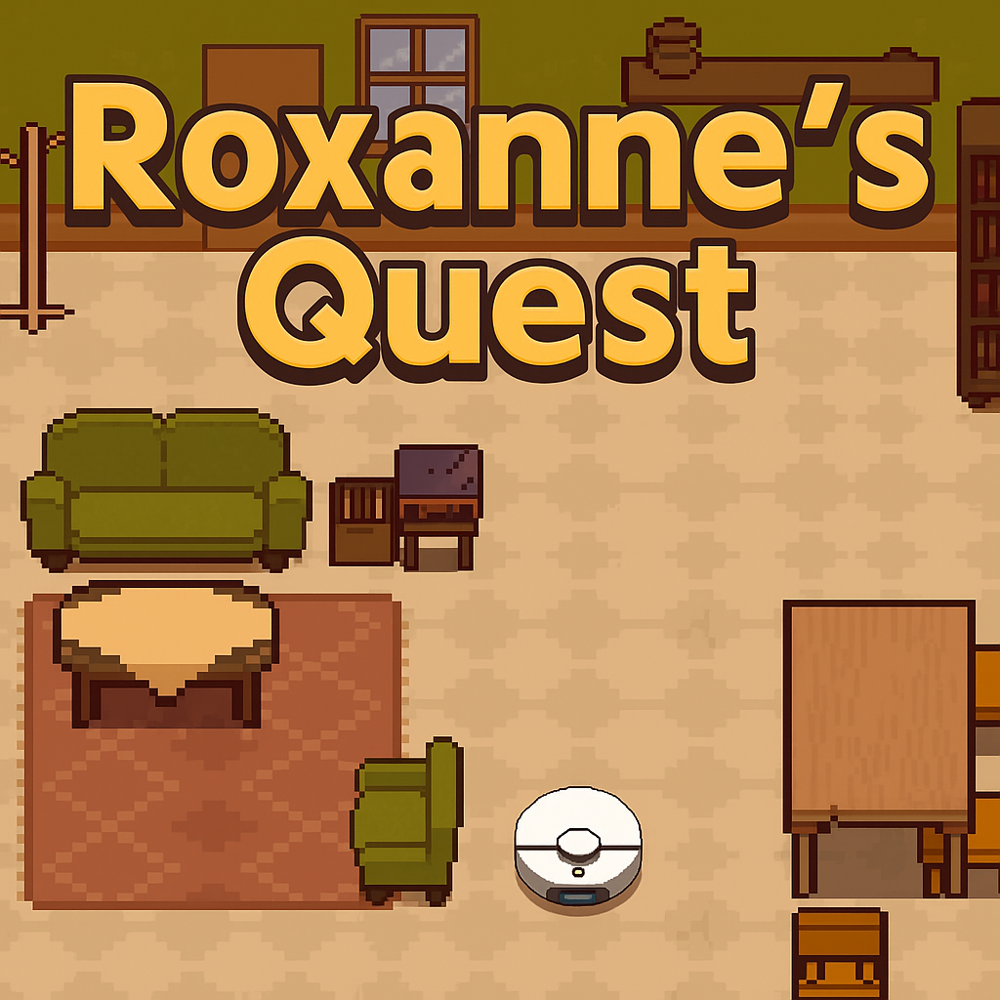

# Roxanne's Quest

\*(development name: **Home Coming**)

A small educational puzzle game designed to teach children how to **plan a sequence of moves** — a gentle introduction to programming concepts like logic, sequencing, and step-by-step thinking.

Developed with the [DragonRuby Game Toolkit](https://dragonruby.org/).

  

## 🎮 How to Play

When the game loads, you’ll see the **title screen** and basic instructions.

### 🧠 Plan Your Moves

Use the **arrow keys** to **queue** the vacuum’s moves.
Each key press adds one step to your planned path:

- **Up** → move one tile upward
- **Down** → move one tile downward
- **Left** → move one tile left
- **Right** → move one tile right

The vacuum will **not** move yet — you're just planning.

Press **E** to **execute** your queued moves.

### ✅ Goal

To complete a level:

1. Reach **all dirty spots** on the map, and
2. Return the vacuum **home**.

---

## 🔐 Password Levels

After levels **5**, **10**, and **15** you’ll receive a **password**.
Write it down!

Next time you launch the game, press **P** on the title screen to open the password screen. Enter the code to skip ahead to the more advanced level.

---

## ✨ Features

- Plan-ahead movement mechanic
- Increasingly challenging levels
- Retro-style tile-based environments
- Custom vacuum sound effects (recorded from a real robot vacuum!)
- Password system for replay sessions

---

## 🌐 Play Now

**Roxanne's Quest** is now live!
Play the early version on **itch.io**:
👉 [https://nikemman.itch.io/roxannes-quest](https://nikemman.itch.io/roxannes-quest)

---

## 📦 Resources & Credits

- **House tiles/sprites:**
  [Penzilla](https://penzilla.itch.io/top-down-retro-interior)

- **Vacuum SFX:**
  Recorded from a real robot vacuum

- **Title music:**
  Melody by Grok 4 Fast + MS Copilot → ABC notation →
  [Michael Eskin’s ABC tool](https://michaeleskin.com/abctools/abctools.html)
